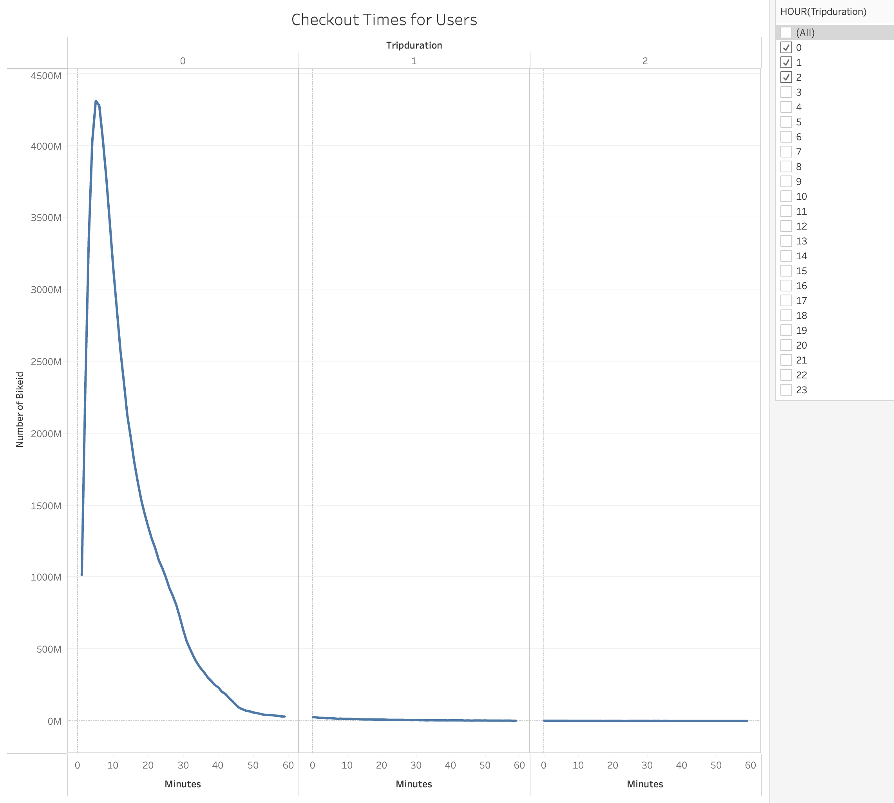
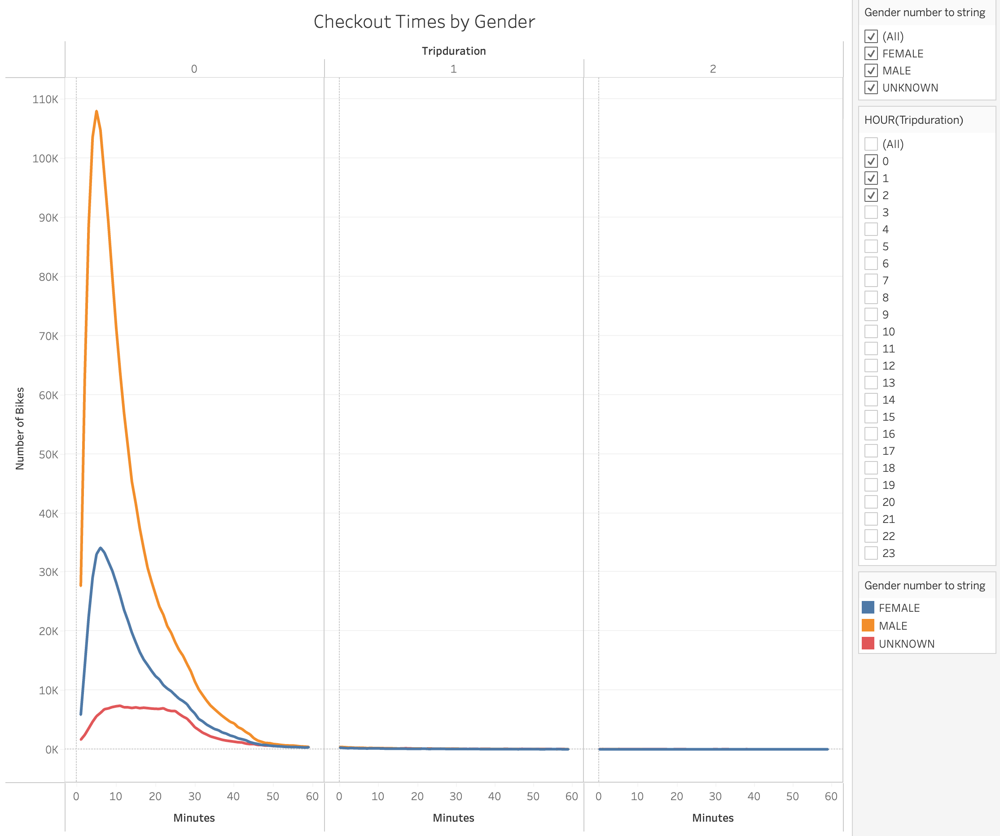
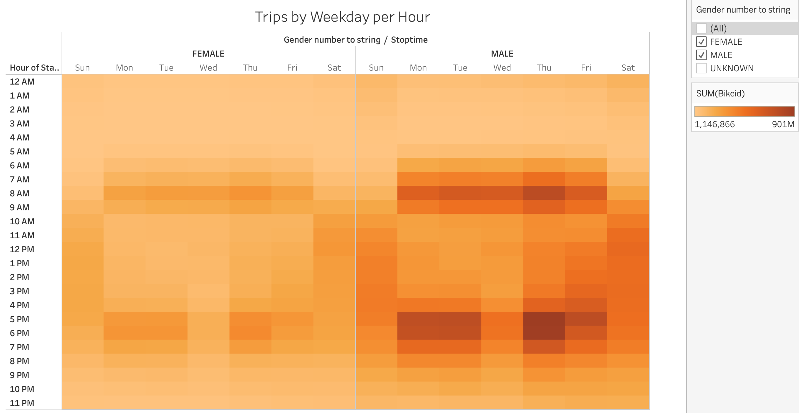
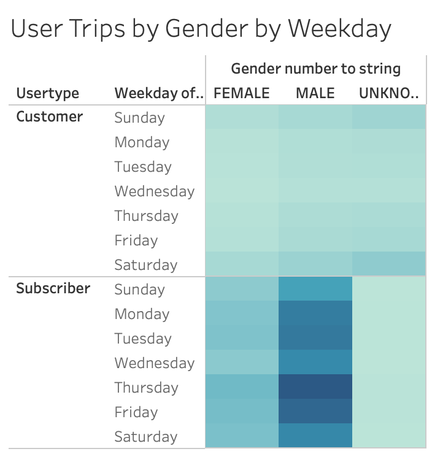
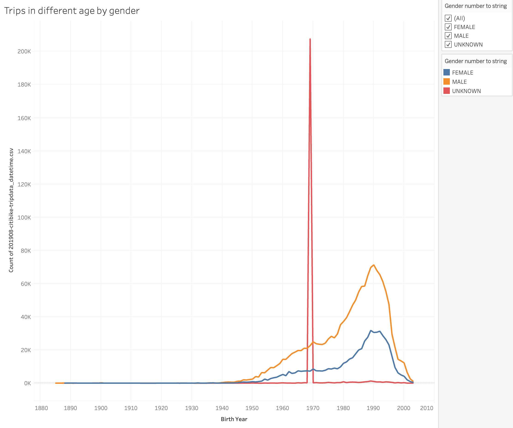
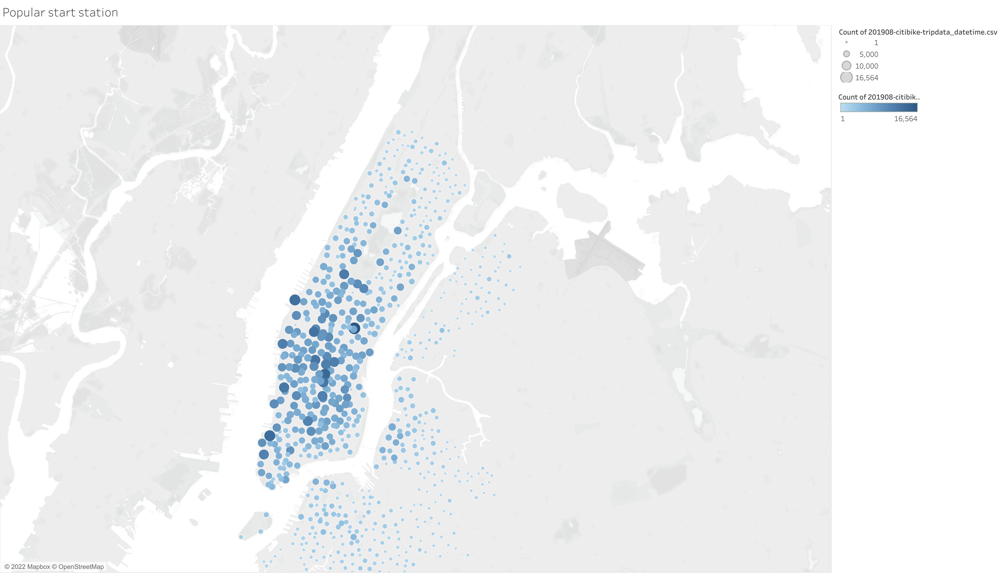
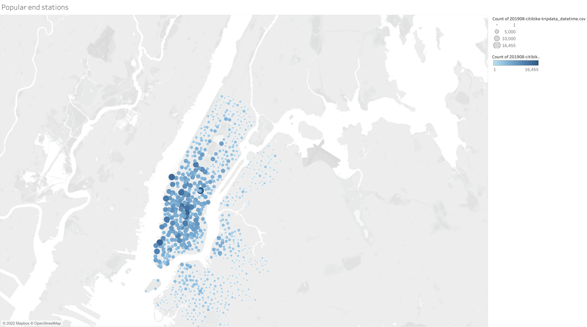
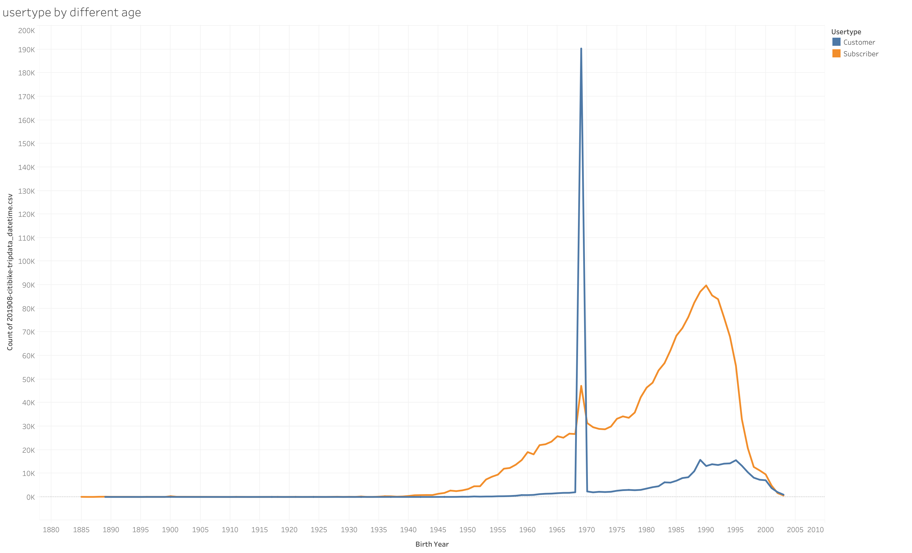
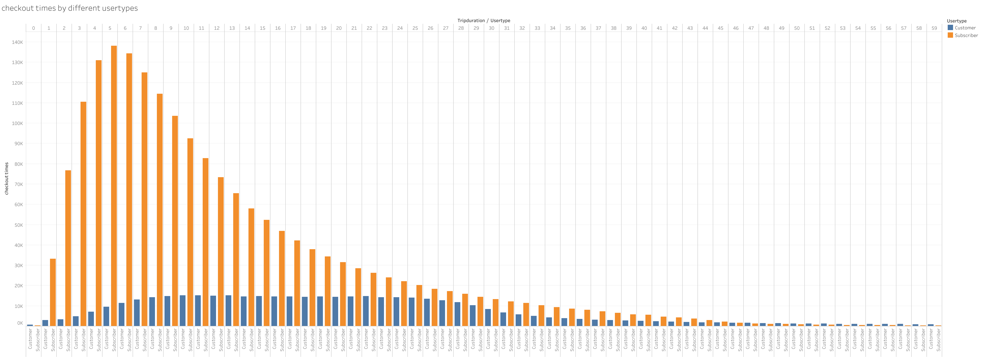

# Overview & purpose of the statistical analysis:
To convince investors that a bike-sharing program in Des Moines is a solid business proposal, this project provides more detailed analysis regarding trips in different time, by different gender. Per the analysis, we will find the both popular start stations and end stations via a clear map showing the number of trips.

For this analysis, I mainly get the help of Tableau. In the meanwhile, pandas also helps to analysis the raw dataset.

# Results:
## Please find the full analysis in Tableau story under the below link:
[Tableau Analysis](https://public.tableau.com/views/CitiBikes_Dashboard_16715087491590/NYCCitiBikesAnalysis?:language=en-US&publish=yes&:display_count=n&:origin=viz_share_link)

1. Looks like most of bike users check out the bikes in around 5 to 6 min.

2. To consistency, per the line graph below, males tend to use the bikes than felames and the most common checkout time is around 5-6 min.

3. Thursday is the most popular workday for the bikes and 8am and 5-6pm are popular time over a day. Per the timing, it is hilighly likely people who need to go to work are most main users.

4. Similar to the above, the popular workday and daytime are consistency between males and females. Again, males tend to use more bikes than females. 

5. Per the graph below, it seems people who were born between 1985 (37 years old ) to 1995 (27 years old ) make up the most users for the bikes in NYC. 

6. This map give all the popular start stations with the different size of circles. It says most people start their trip from the middle town.

7. This map give all the popular start stations with the different size of circles. It says most people start their trip from the middle town and down town.

# Summary:
As discussed above, we can conclude that the goal customers of the Citi bikes are people who need to go work and was born between 1985 (37 years old) to 1995 (27 years old). What's more, the Citi Bikes are most common to be used for short trip rutine around 5-6 min during workdays and expecially popular in 8am and 5-6pm. However, to convince investors about this program. It's significantly to analysis the royal of the users. Therefore, it additionally provide analyis on trips based on different usertypes as following.

- we can conclude per the graph below that people who were born between 1990 tend to subscribe to use the bikes and the investors could advertise promotions/discounts to attact more subscribers.

- It's clearly shows that the checkout times for subscribers tend to more than customers. This is another sign that investors could acctact more subscribers to increase the utilize of bikes.

